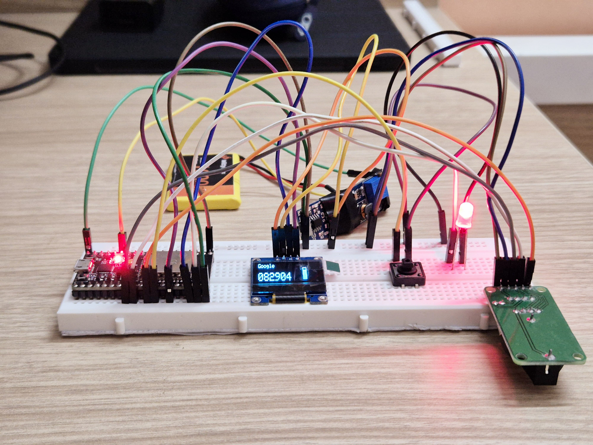
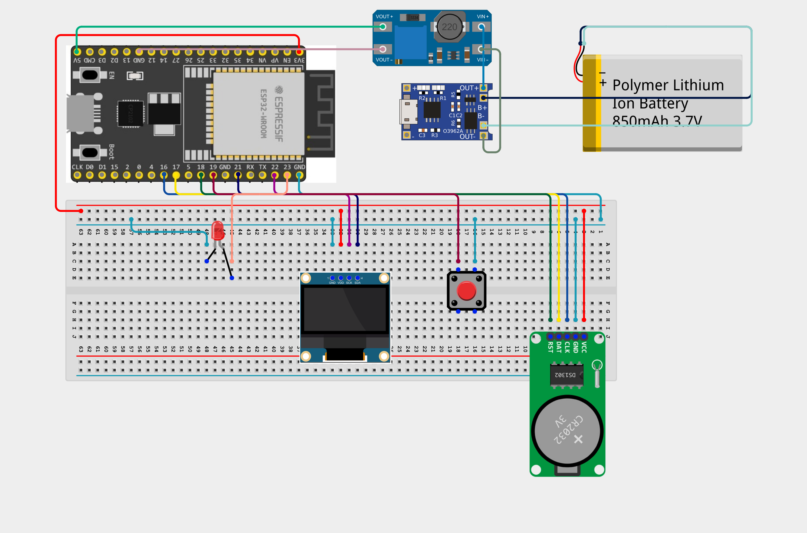
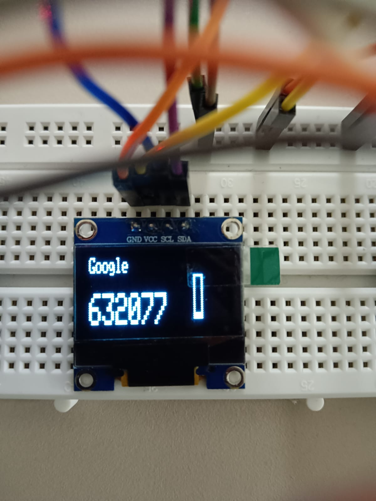
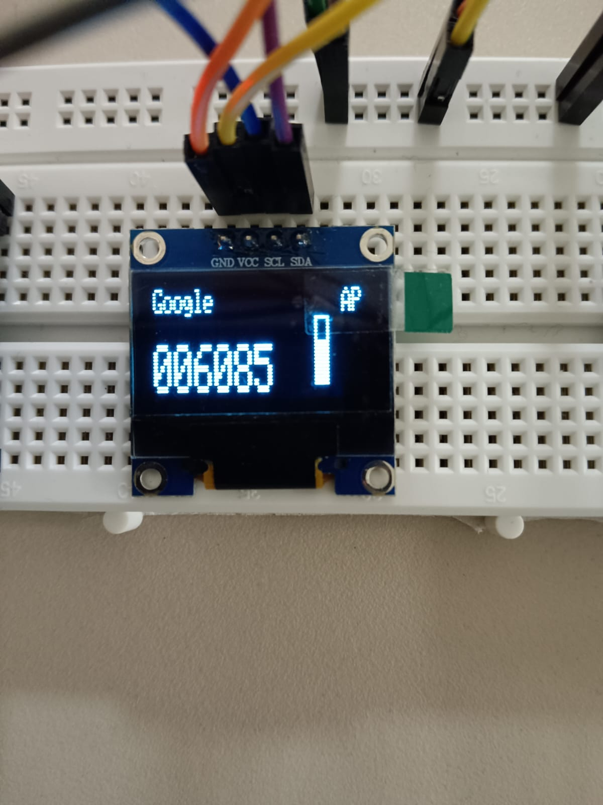

# ESP32 Hardware TOTP Authenticator

A portable, battery-powered Time-based One-Time Password (TOTP) generator built on ESP32 microcontroller. This device provides secure two-factor authentication codes with offline capability and web-based configuration.

## 🚀 Features

### Core Functionality
- **Secure TOTP Generation**: RFC 6238 compliant time-based one-time passwords
- **Offline Operation**: Works without internet connection using built-in RTC
- **Visual Interface**: 128x32 OLED display with countdown progress bar
- **Battery Powered**: Portable design with lithium-ion battery support
- **Web Configuration**: Secure setup interface via WiFi Access Point

### Security Features
- **Hardware-based**: Isolated from smartphone vulnerabilities
- **Encrypted Storage**: TOTP secrets stored securely in EEPROM
- **Access Control**: Configuration only available via physical button press
- **Time Synchronization**: Automatic NTP sync when WiFi available

## 🛠️ Hardware Components

| Component | Function | Connection |
|-----------|----------|------------|
| ESP32 DevKit v1 | Main microcontroller | - |
| SSD1306 OLED (128x32) | Display interface | I2C (SDA/SCL) |
| DS1302 RTC Module | Offline timekeeping | GPIO 16,17,18 |
| Push Button | Configuration trigger | GPIO 19 (Pull-up) |
| Status LED | System indicator | GPIO 23 |
| TP4056 Module | Battery charging | Power management |
| MT3608 Booster | Voltage regulation | 3.7V to 5V |
| 3.7V Li-ion Battery | Portable power | - |

## 📷 Project Images

### Device Assembly

*Complete breadboard assembly showing all components and connections*

 
*Clean wiring layout with proper component placement*

### Configuration Interface

*Secure web-based configuration interface with cyberpunk styling*

### Working Display

*OLED showing account name, TOTP code, and countdown timer*

### Working Display

*OLED showing account name, TOTP code, and countdown timer*

## 🔧 Pin Configuration

```cpp
// RTC Module Connections
#define CLOCK_PIN 16    // DS1302 CLK
#define DATA_PIN 17     // DS1302 DAT  
#define RST_PIN 18      // DS1302 RST

// User Interface
#define PUSH_BUTTON 19  // Config mode button
#define STATUS_LED 23   // Status indicator

// I2C Display (Default pins)
// SDA: GPIO 21
// SCL: GPIO 22
```

## 📦 Installation & Setup

### 1. Environment Setup
```bash
# Clone the repository
git clone https://github.com/yourusername/esp32-totp-generator
cd esp32-totp-generator

# Install PlatformIO (if not already installed)
pip install platformio

# Build and upload
pio run --target upload
```

### 2. Hardware Assembly
1. Connect components according to the pin diagram
2. Ensure proper power distribution (3.3V for ESP32, 5V for display)
3. Test all connections before powering on

### 3. Initial Configuration
1. **Enter Config Mode**: Hold the push button while powering on
2. **Connect to AP**: Join `TOTP_Config_AP` WiFi network (password: `password`)
3. **Access Interface**: Navigate to `192.168.4.1` in web browser
4. **Configure Settings**:
   - Account Name (e.g., "GitHub", "Google")
   - TOTP Secret Key (from your service provider)
   - WiFi credentials for internet sync
5. **Save & Restart**: Device will reboot and begin generating codes

## 🔐 Security Considerations

### Access Control
- Configuration interface only accessible via physical button
- Web interface restricted to Access Point connections
- No remote configuration capabilities

### Data Protection
- TOTP secrets encrypted in EEPROM storage
- No cloud connectivity for sensitive data
- Local time synchronization with secure NTP

### Best Practices
- Change default AP password in production
- Use strong WiFi credentials
- Regularly verify time synchronization
- Keep device firmware updated

## 💡 Usage Instructions

### Normal Operation
1. **Power On**: Device displays account name and current TOTP code
2. **Read Code**: Use the 6-digit code for authentication
3. **Monitor Timer**: Progress bar shows remaining validity time
4. **Code Refresh**: New code generated every 30 seconds

### Status Indicators
- **LED Blinking**: Attempting WiFi connection
- **LED Solid**: Connected and synchronized
- **"AP" on Display**: Access Point mode active

### Troubleshooting
| Issue | Solution |
|-------|----------|
| No display | Check I2C connections and power |
| Wrong time | Verify NTP sync or RTC battery |
| WiFi fails | Reconfigure credentials via AP mode |
| Codes don't work | Verify secret key and time sync |

## 🔧 Development

### Building from Source
```bash
# Install dependencies
pio lib install

# Build project
pio run

# Upload to device
pio run --target upload

# Monitor serial output
pio device monitor --baud 115200
```

### Code Structure
- `setup()`: Hardware initialization and configuration loading
- `loop()`: Main execution cycle (display updates, web server, TOTP generation)
- `base32_decode()`: Converts Base32 secret keys to binary format
- `handleRoot()`: Serves configuration web interface
- `drawWaterLevel()`: Renders countdown progress bar

### Debug Output
Monitor serial console (115200 baud) for:
- System initialization status
- WiFi connection details
- Generated TOTP codes with timestamps
- Configuration changes and errors

## 🔄 Advanced Features

### Web Interface
- **Modern Design**: Cyberpunk-themed responsive interface
- **Form Validation**: Input verification and error handling
- **Security**: IP-based access restriction
- **Mobile Friendly**: Works on smartphones and tablets

### Display Features
- **Multi-line Layout**: Account name, TOTP code, status indicators
- **Progress Animation**: Visual countdown with smooth updates
- **Status Icons**: AP mode and connectivity indicators
- **Low Power**: Optimized refresh rate for battery life

## 📚 Technical Specifications

- **Microcontroller**: ESP32 (240MHz dual-core)
- **Memory**: 4MB Flash, 520KB SRAM
- **Display**: 128x32 OLED (I2C)
- **Power**: 3.7V Li-ion with boost regulation
- **Connectivity**: WiFi 802.11 b/g/n
- **Timekeeping**: DS1302 RTC with backup battery
- **Dimensions**: Compact breadboard form factor

## 🤝 Contributing

Contributions welcome! Please follow these guidelines:

1. Fork the repository
2. Create feature branch (`git checkout -b feature/amazing-feature`)
3. Commit changes (`git commit -m 'Add amazing feature'`)
4. Push to branch (`git push origin feature/amazing-feature`)
5. Open Pull Request

## 🙏 Acknowledgments

- **ESP32 Community** for extensive documentation and examples
- **Adafruit Industries** for excellent hardware libraries
- **RFC 6238** authors for TOTP specification
- **Open Source Contributors** for Arduino ecosystem

---

**⚠️ Disclaimer**: This device is intended for educational and personal use. Always follow your service provider's security guidelines and maintain backup authentication methods.
