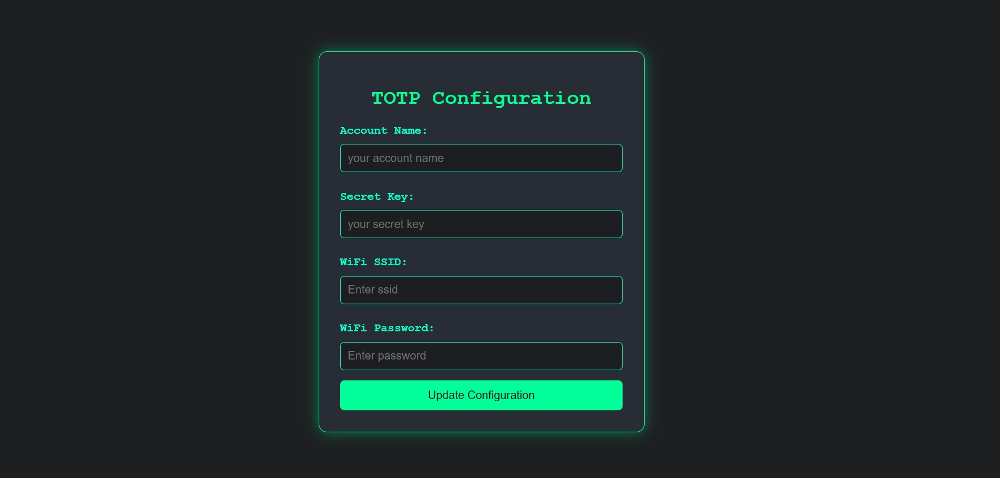

# Hardware based Two factor authentication (ESP32-Based TOTP Generator)

A secure, hardware-powered Time-based One-Time Password (TOTP) generator built using an ESP32 microcontroller. This device generates TOTP codes compatible with standard two-factor authentication (2FA) systems and presents them on an OLED display.

## Key Features

- 🔐 Secure generation of TOTP codes
- 📱 OLED display with a countdown timer
- ⚡ WiFi-based real-time synchronization
- ⏰ Offline timekeeping with an RTC module
- 🛠️ Web-based configuration interface
- 🔄 Visual indicator for code validity
- 💾 Persistent settings storage
- 🔒 Secure Access Point mode for configuration
- 🖥️ Serial monitoring for debugging

## Required Hardware

- ESP32 Development Board
- SSD1306 OLED Display (128x32)
- DS1302 RTC Module
- Push Button
- Status LED
- Connecting wires

### Output Preview


### TOTP Configuration Web Interface



### Demonstration

[Watch the video](https://www.youtube.com/watch?v=t_AUBZh5xeY)

## Installation Guide

1. Clone the repository:
   ```bash
   git clone https://github.com/sabeshraaj/hardware-based-two-factor-authentication
   ```

2. Install the necessary libraries in the Arduino IDE:
   - WiFi
   - Wire
   - NTPClient
   - TOTP
   - WebServer
   - Adafruit_GFX
   - Adafruit_SSD1306
   - ThreeWire
   - RtcDS1302

3. Assemble the hardware as per the pin configuration.

4. Upload the firmware to the ESP32 board.

## Configuration Steps

### Initial Setup

1. Power on the device while holding the configuration button to enter Access Point mode.
2. Connect to the `TOTP_Config_AP` WiFi network (password: `password`).
3. Open a web browser and go to `192.168.4.1`.
4. Enter the required configuration details:
   - Account Name
   - TOTP Secret Key
   - WiFi SSID
   - WiFi Password
5. Save the settings and restart the device.

### Pin Assignments

```cpp
#define CLOCK_PIN 16     // CLK/SCL pin for RTC
#define DATA_PIN 17      // DAT/SDA pin for RTC
#define RST_PIN 18      // RST/CE pin for RTC
#define PUSH_BUTTON 19  // Button for entering configuration mode
#define STATUS_LED 2    // LED for status indication
```

## How to Use

1. Power on the device.
2. The OLED screen will display:
   - Account name
   - Current TOTP code
   - Countdown timer for code validity
3. To modify settings, press and hold the push button to enter AP mode.
4. The status LED provides feedback:
   - Blinking: Attempting to connect to WiFi
   - Solid: Successfully connected and operational
5. View serial output (115200 baud) for:
   - Startup messages
   - WiFi connection status
   - Generated TOTP codes
   - Debugging details

## Security Measures

- AP mode is accessible only via a physical button press.
- The web interface is restricted to AP mode.
- TOTP secrets are securely stored in EEPROM.

## Debugging Information

The device outputs real-time debugging data via the serial port at a baud rate of 115200. Debugging includes:
- Device initialization status
- WiFi connection logs
- Generated TOTP codes and associated accounts
- Configuration updates
- Error logs

### To View Debug Logs:

1. Connect the ESP32 to your computer via USB.
2. Open the Arduino IDE Serial Monitor or another terminal.
3. Set the baud rate to 115200.
4. Monitor real-time logs and debugging messages.

## Contributions

Contributions are welcome! Feel free to submit a Pull Request with improvements or new features.

## Credits

- ESP32 Development Community
- Adafruit Industries for OLED libraries
- Developers of the Arduino TOTP and RTC DS1302 libraries

## Support & Issues

For bug reports, questions, or contributions, please open an issue on the GitHub repository.

---
